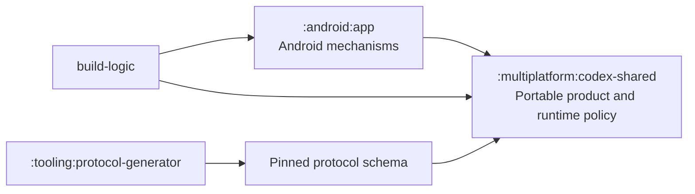

# Architecture

## Module and dependency boundaries

All Gradle modules live under root-level `modules`. There are two production
modules: one shared KMP module and one Android application. Tooling has no
production dependency edge.

`codex-shared` is physically `commonMain`-only. It owns the pinned generated
protocol, JSON-RPC connection and framing, runtime configuration and security
policy, agent behavior, session controller, application state and reducers,
DataStore preference semantics, and Compose Multiplatform UI. Its logical
Android target exists only so Android can consume the common artifact.

The Android app owns concrete framework mechanisms: Activity/Application,
foreground service and notification, permissions and storage discovery,
browser intents, app-private paths, ABI and certificate discovery,
`AndroidSQLiteDriver`, Java `ProcessBuilder`, raw streams, Java sockets, and
the RaTeX bitmap/view bridge. Android adapts these mechanisms to narrow common
contracts; it does not duplicate product policy.

## Runtime

The exact App Server release assets and archive/binary SHA-256 values are
pinned. A typed configuration-cache-safe task downloads and verifies each
supported ABI into centralized build output, which the Android source set
packages as generated `jniLibs`.

Before launch the Android runtime verifies the packaged identity and executable
hash, creates a minimal allowlisted environment, builds a session certificate
bundle, installs the common SQLite log privacy guard, and starts the binary
with Java `ProcessBuilder`. Raw stdout bytes pass through the common bounded
UTF-8 JSON-line framer. Stderr is drained without content logging. Shutdown
closes stdin, waits for a bounded interval, forces termination if necessary,
closes socket forwarding, and removes session certificate material.

Outbound App Server traffic uses an authenticated loopback Java-socket CONNECT
proxy. Common code parses and authorizes requests; Android resolves addresses
and owns sockets. Only TLS port 443 and public destinations are accepted.

## Extensions

The app uses the official App Server plugin and skill protocol for discovery,
installation, enablement, removal, and MCP authentication. There is no mobile
provider API, custom marketplace/source host, downloaded executable extension,
or dependency on another repository.
