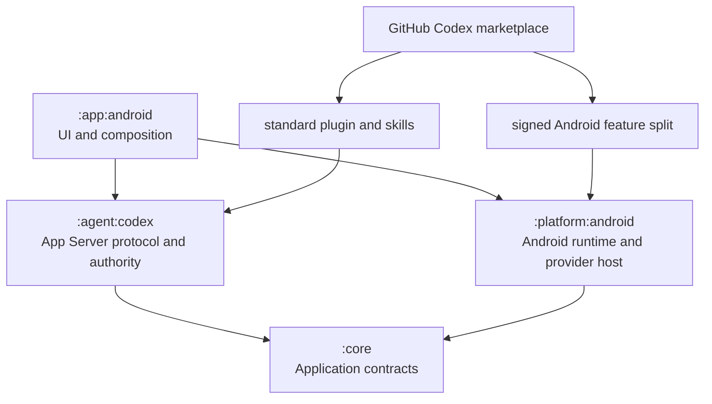

# Architecture

## Runtime and module boundaries

`AppServerConnection` owns JSON-RPC IDs, initialization, correlation, framing, timeouts, and restart state. Its `CodexRuntime` dependency carries JSON lines and typed start, I/O, EOF, and exit failures. `AndroidCodexRuntime` alone owns the App Server executable, `ProcessBuilder`, environment, streams, proxy, exit watcher, and shutdown. App Server is the only packaged standalone payload launched by Android; ordinary shell execution remains owned by App Server.

## Plugin source and Android provider

The Extensions screen registers a public GitHub source through App Server `marketplace/add`. App Server remains authoritative for discovery, installation, enablement, plugin-scoped skills, and new-chat visibility. A display-only cache shows the last complete `plugin/list` response immediately while one 20-second refresh runs. Failures keep the cached result and expose a manual retry; the response is not streamed because the pinned method is a single response.

A plugin may place `codex-mobile-addon.json` beside its standard manifest. Ordinary plugins may come from any App Server marketplace; the official app accepts Android provider metadata only when the App Server-owned Git checkout identifies `ciurlaro/codex-mobile-plugins` as its origin. The add-on declares a signed feature split, checksums, exact host version, provider API compatibility, schema digest, entry point, settings entry point, and MCP server names. The host requires those MCP names to exactly match the standard plugin declaration, restricts the package URL to that repository's GitHub releases, and installs through `PackageInstaller.MODE_INHERIT_EXISTING`, so Android enforces application ID, version code, split identity, and signer. The next process verifies the loaded descriptor and schema before completing App Server plugin installation. Android disables exactly those MCP entries because local dynamic tools provide execution.

The base APK contains no plugin definitions or implementations. Provider projects enter a build only through the explicit `codexMobile.providerProjects` property. Installed entry points implement the small `CodexMobileProvider` contract and exchange project-owned calls, contexts, descriptors, secret requirements, and results. Android or library-specific types never cross it. `ProviderSecretStore` is the platform-neutral scoped storage contract; Android implements it with Android Keystore and providers receive only a read-only `ProviderSecrets` snapshot at execution. Values are never packaged in the split. There is no Binder transport, child provider process, HTTP bridge, executable backend, second marketplace, or second enablement store.

App Server configuration is the sole plugin-enablement authority. Provider package lifecycle records track only installation/removal continuation. A generic dispatcher maps each descriptor's closed tool identifiers to the verified provider and rechecks enablement, cancellation, deadline, approval, and workspace authority immediately before execution.

Disabling commits App Server configuration under the global provider gate and retains the split, its secret namespace, and provider-owned data. Uninstall first revokes authority, lets the provider use its existing secrets for required remote cleanup, deletes that namespace only after confirmed preparation, removes the App Server registration, schedules split removal, and reports completion only after a restart verifies absence. Ambiguous cleanup stays retryable with code and credentials retained but no agent authority. An interrupted split-removal transaction remains visible as provider-neutral cleanup that the user can retry.
Durably prepared removals resume after `plugin/installed` returns, so a process death between App Server removal and split removal cannot strand executable provider code.

New threads receive only the currently enabled schemas and plugin skills. Each thread stores its original provider set and last announced availability. Active threads receive a reserved hidden steer; idle or resumed threads receive a hidden injected snapshot. A race queues the update until turn completion. Stale schemas never restore authority because dispatch always fails closed.

## Mutation and workspace authority

The selected shared-storage path is each turn's starting `cwd` for the ordinary App Server shell, not a shell sandbox. Provider file operations receive a context whose workspace is enforced as a hard boundary.

A SQLite journal covers provider mutations only. `(thread_id, turn_id, call_id)` is unique and bound to a canonical arguments hash. While a provider is installed, a terminal duplicate replays its exact result and a dispatched operation is reconciled or becomes indeterminate without another provider submission. Confirmed uninstall deletes undispatched rows and strips results and reconciliation evidence from the remaining replay-prevention tombstones. One mutex closes execution, disablement, deadline, and approval races.

With App Server `0.144.6`, Never dispatches typed mutations directly; Ask me and Strict use a one-use approval permit; Auto review mutations remain unavailable because dynamic tools have no equivalent automatic-review bridge.

## Portability

Standard plugin manifests, skills, schemas, DTOs, validation, and routing can be shared with another Codex host. Platform execution cannot: each target supplies its own provider behind the same semantic contract. Regular Codex installations use the plugin's declared MCP provider; Android uses the signed feature split and disables that MCP entry. A third-party split must match the exact host version and signing certificate, so fork maintainers sign matching host and provider artifacts themselves.

Feature splits and the base APK share one Android version code. A host update therefore includes matching replacements for every installed provider split in the same package transaction, or completes the normal provider-removal lifecycle before updating the base. Post-update repair is only for a provider that is absent or inactive; it is not a substitute for a valid Android package update transaction.
