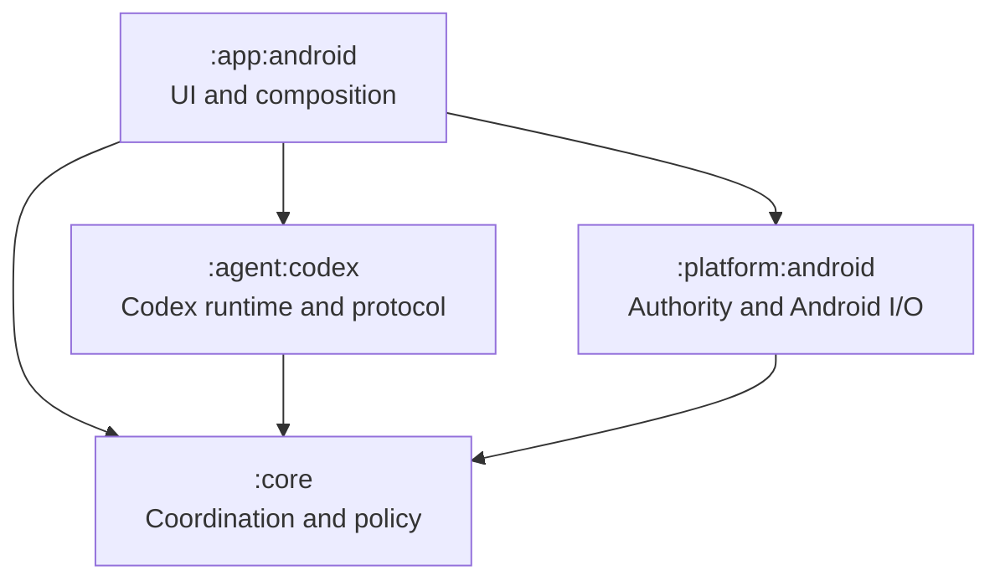
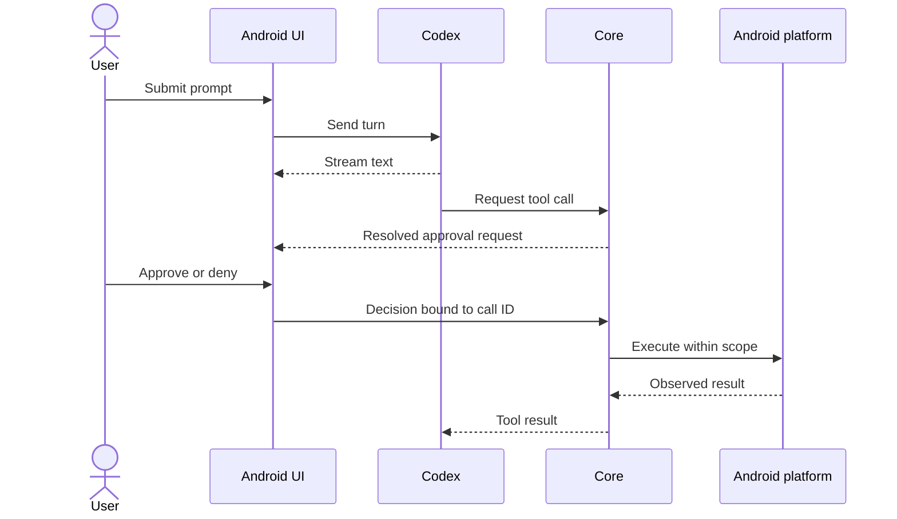

# Architecture

## Module topology

`Agent` and `Platform` do not depend on each other. The app composes them through the narrow process-launch callback owned by `CodexAgentClient`; no generic process abstraction belongs in core.

## Responsibilities

| Module | Does | Does not |
|---|---|---|
| `:app:android` | Render events, collect prompts and approvals, compose implementations | Grant itself authority or interpret provider protocol |
| `:core` | Define agent/tool contracts, coordinate calls, enforce approval and recovery policy | Import Android SDK types or perform Android I/O |
| `:agent:codex` | Start/stop app-server, authenticate, speak JSON-RPC, translate events | Decide whether a device operation is permitted or completed |
| `:platform:android` | Resolve SAF scopes, launch processes, execute tools, persist Android truth | Own conversation semantics |

## Authority flow

Only the platform result can establish whether an Android operation succeeded. A provider request, response, timeout, or repeated call ID is correlation—not proof of exactly-once execution.

## Dependency rules

- Core may use JVM/Kotlin libraries, but no `android.*` or `androidx.*` API.
- Provider DTOs remain internal to `:agent:codex`.
- SAF `Uri`, `Context`, `ContentResolver`, services, and persistence remain in Android modules.
- Extract internal Codex collaborators only after measured complexity or an independent state machine appears.
