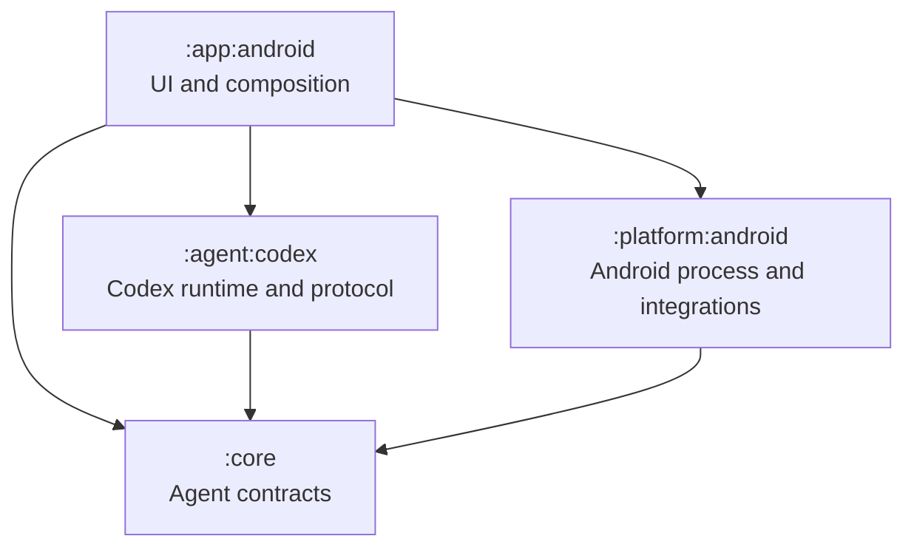

# Architecture

## Module topology

| Module | Responsibility |
|---|---|
| `:app:android` | Compose UI, settings, workspace picker, foreground lifecycle |
| `:core` | Provider-neutral agent contracts |
| `:agent:codex` | Authentication, app-server JSON-RPC, turns, approvals, dynamic-tool authority, and shell activity |
| `:platform:android` | Runtime launch, shared-storage validation, built-in plugin handlers, mutation journal, and Telegram login |

Inside `:agent:codex`, `AppServerConnection` owns JSON-RPC IDs, initialization, request correlation, protocol parsing, timeouts, and restart state without importing process or Android APIs. Its narrow `CodexRuntime` dependency emits received JSON lines plus typed start, I/O, EOF, and exit failures. `AndroidCodexRuntime` alone owns the app-server executable, `ProcessBuilder`, streams, environment, proxy, log guard, exit watcher, and deterministic shutdown. `CodexAgentClient` owns authentication, conversations, turns, approvals, plugin enablement, dynamic-tool dispatch, and conversion to provider-neutral events.

## Workspace and shell

The user grants Android **All files access** and selects a directory from the app's small local picker. Its canonical absolute path is passed as `cwd` on every Codex turn. Codex's ordinary shell therefore lists, reads, creates, overwrites, copies, moves, and deletes files in that workspace without a duplicate Android file API.

The bundled app-server process and credentials still live in backup-excluded app-private storage. For ordinary shell commands the selected directory is a starting directory, not a security sandbox: `MANAGE_EXTERNAL_STORAGE` lets the app access other shared storage except platform-protected locations. Built-in plugin paths are stricter: every request is canonicalized under that session's selected workspace, and escaped, app-private, `Android/data`, and `Android/obb` paths are rejected.

## Built-in plugins and private backends

One app-owned marketplace seeds `documents@codex-mobile` and `telegram@codex-mobile`. They are installed by default, cannot be uninstalled, and use the existing plugin UI and app-server `plugins.<id>.enabled` configuration. New chats receive only enabled tools and plugin-scoped skills. Existing chats keep the schemas advertised when they were created, but every invocation rechecks current enablement under the same global gate used for configuration changes.

Pinned app-server `0.144.6` transports strict `item/tool/call` requests for three Documents tools and seven Telegram tools. Schemas expose semantic fields, enums, and bounds—not commands, subcommands, argument vectors, or arbitrary property maps. Reads use immutable private snapshots and bounded cursors. Document mutations stage and validate a sibling file, require an expected SHA-256 for overwrite, and use atomic replacement. Telegram sends invoke exactly one private process with `--retries 0`.

`mutool`, English-data `tesseract`, `officecli`, and `tgcli` remain packaged, but Kotlin starts them only by fixed absolute paths with backend-specific minimal environments. None is exposed on the app-server `PATH`. Telegram login remains browserless in Settings and uses the same private session; disabling the plugin removes agent authority without deleting that session.

On app-server `0.144.6`, Never dispatches typed mutations directly; Ask me and Strict reuse the existing approval event with a one-use local permit; Auto review is unavailable because dynamic tools have no equivalent automatic-review bridge. Ordinary shell and file-change approvals keep their app-server paths.

A minimal SQLite journal covers built-in mutations only. `(thread_id, turn_id, call_id)` is unique and bound to a canonical argument hash. Terminal duplicates replay the exact result. A call observed after `DISPATCHED` is reconciled or reported indeterminate and is never submitted to Telegram again. One global mutex deliberately serializes built-in calls and enablement changes; split locks only after measured contention.

## Session lifetime

A non-exported foreground service owns the active Codex client while authentication, a turn, an approval, a tool call, or a reported work activity is active. Its private notification states the current category and disappears when the service becomes idle.

## Data lifecycle

Credentials, Codex history, bundled runtime assets, document snapshots, mutation journal rows, and Telegram session data remain in backup-excluded app-private storage. The workspace preference stores only the selected path. Sign-out removes ChatGPT authentication; confirmed full erasure delegates to Android's native app-data reset and never deletes shared user files.

## Dependency rules

- Core contains no Android SDK types.
- App-server protocol DTOs stay inside `:agent:codex`.
- Android permission, storage, process, and intent APIs stay inside Android modules.
- Ordinary filesystem work retains Codex's shell. Documents and Telegram cross a typed Android authority gate and never expose their native backend commands to that shell.
