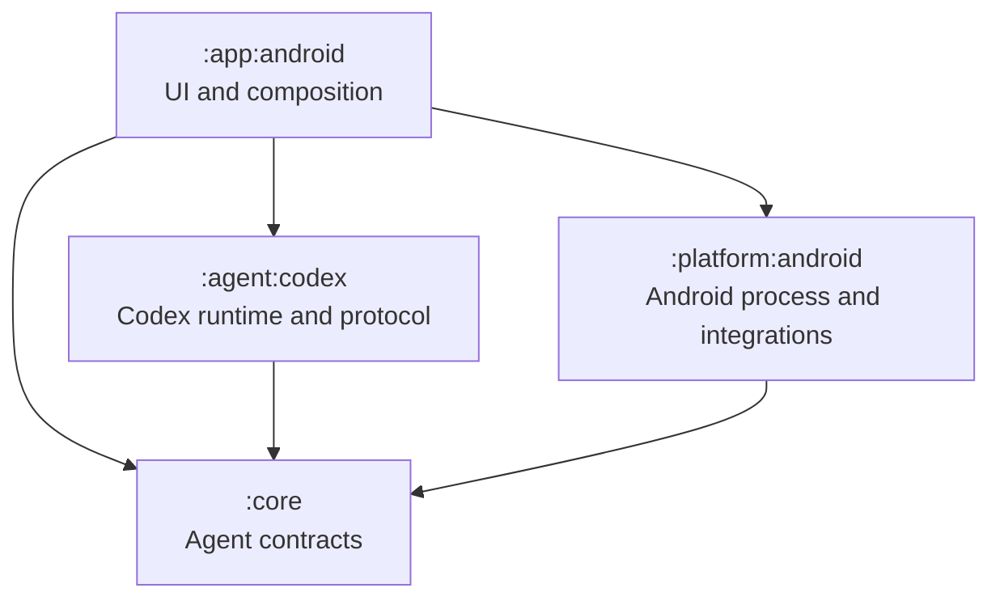

# Architecture

## Module topology

| Module | Responsibility |
|---|---|
| `:app:android` | Compose UI, settings, workspace picker, foreground lifecycle |
| `:core` | Provider-neutral agent contracts |
| `:agent:codex` | Authentication, app-server JSON-RPC, turns, approvals, and shell activity |
| `:platform:android` | Runtime launch, shared-storage workspace, bundled CLI installation, Telegram login |

## Workspace and shell

The user grants Android **All files access** and selects a directory from the app's small local picker. Its canonical absolute path is passed as `cwd` on every Codex turn. Codex's ordinary shell therefore lists, reads, creates, overwrites, copies, moves, and deletes files in that workspace without a duplicate Android file API.

The bundled app-server process and credentials still live in backup-excluded app-private storage. The selected directory is a starting directory, not a security sandbox: `MANAGE_EXTERNAL_STORAGE` lets the app access shared storage except platform-protected locations such as `Android/data` and `Android/obb`. Codex's own approval policy remains the user-selectable control for shell commands.

At startup Android installs four ordinary commands into a private directory prepended to the app-server's `PATH`:

- `mutool` reads, inspects, renders, and transforms PDFs.
- `tesseract` performs local OCR on bounded images rendered by `mutool`.
- `officecli` reads and edits DOCX, XLSX, and PPTX files.
- `tgcli` reads and sends Telegram content after the user connects an account in Settings.

Two small local Codex skills explain when to use these familiar command surfaces. They are discovery hints, not another execution layer. Ghostscript and qpdf are intentionally not bundled because the current `mutool` surface covers the required PDF work without two more native distributions.

Telegram login is browserless: the Settings UI starts the bundled `tgcli`, collects the phone code and optional 2FA password, and keeps its session in backup-excluded private storage. Codex then invokes the same `tgcli` command under the selected approval policy.

## Session lifetime

A non-exported foreground service owns the active Codex client while authentication, a turn, an approval, a tool call, or a reported work activity is active. Its private notification states the current category and disappears when the service becomes idle.

## Data lifecycle

Credentials, Codex history, bundled runtime assets, and Telegram session data remain in backup-excluded app-private storage. The workspace preference stores only the selected path. A one-time migration releases obsolete persisted URI grants and removes the former SAF workspace databases. Sign-out removes ChatGPT authentication; confirmed full erasure delegates to Android's native app-data reset and never deletes shared user files.

## Dependency rules

- Core contains no Android SDK types.
- App-server protocol DTOs stay inside `:agent:codex`.
- Android permission, storage, process, and intent APIs stay inside Android modules.
- Ordinary filesystem, document, and Telegram work uses the shell-visible CLI surface; Android code is limited to permission, installation, login, and lifecycle mechanics.
