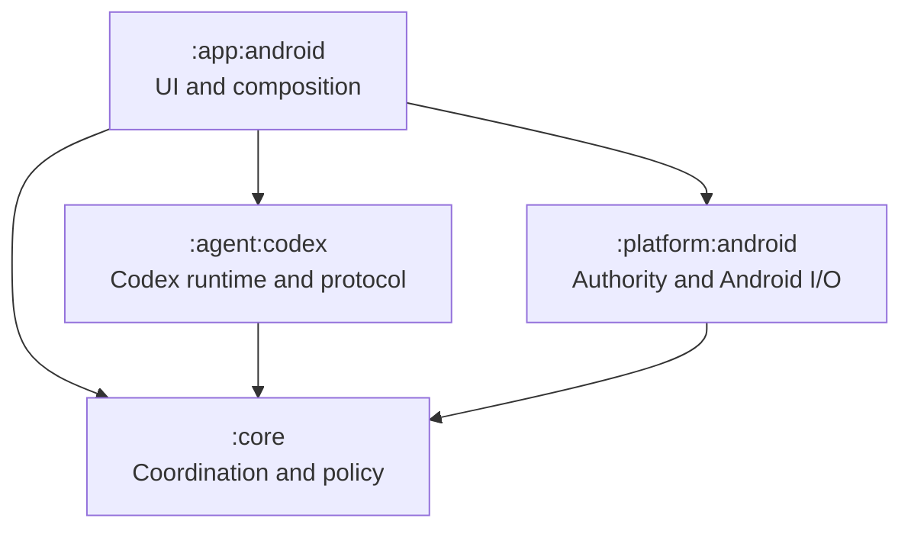
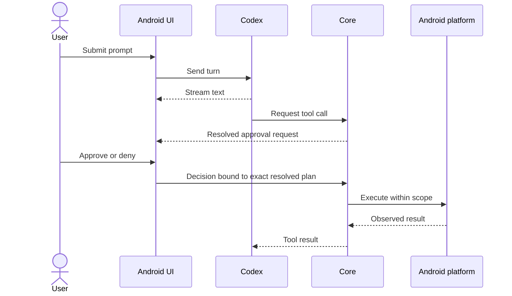

# Architecture

## Module topology

`Agent` and `Platform` do not depend on each other. The app composes them through the narrow process-launch callback owned by `CodexAgentClient`; no generic process abstraction belongs in core.

## Responsibilities

| Module | Does | Does not |
|---|---|---|
| `:app:android` | Render events, collect prompts and approvals, compose implementations | Grant itself authority or interpret provider protocol |
| `:core` | Define agent/tool contracts, coordinate calls, enforce approval and recovery policy | Import Android SDK types or perform Android I/O |
| `:agent:codex` | Start/stop app-server, authenticate, speak JSON-RPC, translate events | Decide whether a device operation is permitted or completed |
| `:platform:android` | Resolve SAF scopes, launch processes, execute tools, persist Android truth | Own conversation semantics |

## Authority flow

Only the platform result can establish whether an Android operation succeeded. A provider request, response, timeout, or repeated call ID is correlation—not proof of exactly-once execution.

The pinned app-server registers Android capabilities as dynamic tools on the existing session. Read-only plans are allowed by core policy and dispatched directly; mutating plans require an explicit, one-use UI decision bound to the exact resolved plan. The app-server receives only the `ToolResult` produced from Android's observed provider outcome.

After approval, core requires durable `Prepared` and `Executing` journal transitions before mutation dispatch. Android stores the minimum tool-specific recovery intent in an app-private SQLite database. On restart, a `Prepared` row is safely closed as not dispatched; an `Executing` row becomes `Unknown` before the tool re-observes Android state. Reconciliation never executes the mutation, unresolved outcomes remain user-visible until acknowledged or resolved, and retry remains a tool-specific decision over a fresh plan rather than a call-ID policy.

## Active session lifetime

An explicit UI action starts one non-exported `dataSync` foreground service. That service owns one `ForegroundSessionController` and one `CodexAgentClient`; Activities bind only to render its bounded state and may disappear without closing it. The controller excludes duplicate turns and gives one visible UI owner a claim on each tool request, but the ViewModel still resolves Android plans and the UI still makes every mutation approval decision. A one-use private start authorization rejects unsolicited starts. Stop, Android timeout, or notification action cancels active work within five seconds, closes the app-server, removes the notification, and does not schedule or reboot-restart anything.

## Dependency rules

- Core may use JVM/Kotlin libraries, but no `android.*` or `androidx.*` API.
- Provider DTOs remain internal to `:agent:codex`.
- SAF `Uri`, `Context`, `ContentResolver`, services, and persistence remain in Android modules.
- Extract internal Codex collaborators only after measured complexity or an independent state machine appears.
