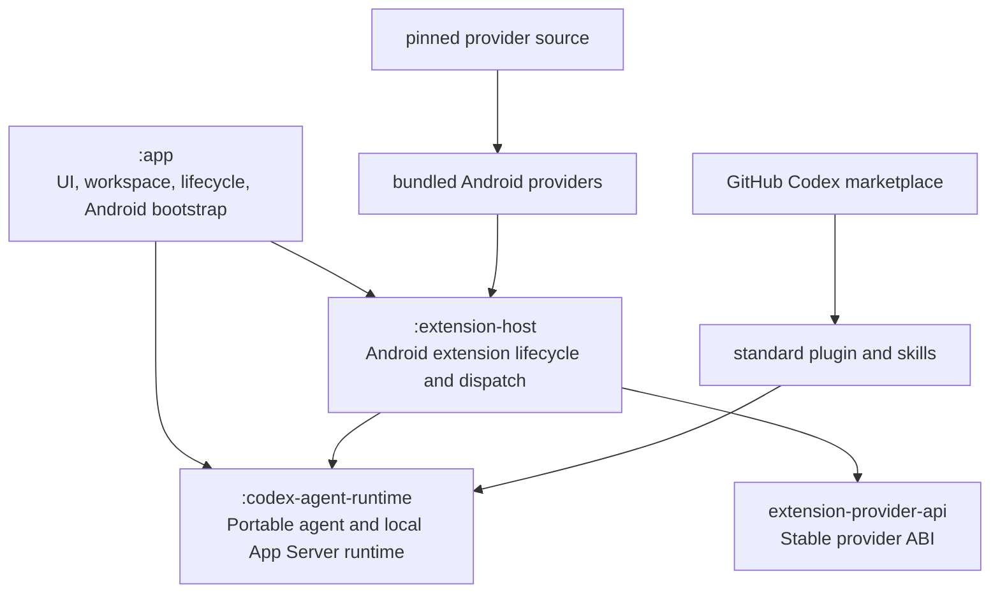

# Architecture

## Runtime and module boundaries

The published `codex-agent-runtime` KMP artifact owns the exact `0.145.0` protocol identity, `AgentClient` and `CodexAgentClient`, generated protocol, JSON-RPC transport, and local runtime. Its checked-in authoritative stable-v2 schema is bound to the exact upstream tag, revision, source paths, and SHA-256 digests; normal builds verify that input and do not fetch or regenerate it. `AppServerConnection` owns JSON-RPC IDs, initialization, correlation, framing, timeouts, and restart state through the generated typed protocol. Product calls pass generated request and response types directly; there is no raw JSON-RPC request adapter in the mobile code.

The common runtime verifies the immutable distribution identity and executable checksum, constructs an allowlisted environment, concatenates platform-supplied certificates, starts App Server through `kmp-process`, protects outbound CONNECT traffic with an authenticated Ktor loopback proxy, installs the AndroidX SQLite KMP log-privacy guard, frames messages, and owns cancellation and cleanup. The only Android runtime adapter is the immutable bootstrap under `android/app/.../runtime/bootstrap`; it supplies packaged/application paths, native-library and ABI information, certificate paths, secure proxy entropy, and `AndroidSQLiteDriver`. App Server is the only packaged standalone payload launched by Android.

## Plugin source and Android provider

The Extensions screen downloads a public GitHub marketplace as a bounded ZIP, validates its manifest and local paths, records its canonical GitHub origin, and atomically refreshes a stable app-private snapshot. It then registers that local path through App Server `marketplace/add`, avoiding an unavailable Android `git` executable while leaving App Server authoritative for discovery, installation, enablement, plugin-scoped skills, and new-chat visibility. A display-only cache shows the last complete `plugin/list` response immediately while one 20-second refresh runs. Failures keep both the previous marketplace snapshot and cached catalog and expose a manual retry; the response is not streamed because the pinned method is a single response.

A plugin may place `codex-mobile-addon.json` beside its standard manifest. Ordinary plugins may come from any registered marketplace; the official app accepts Android provider metadata only when the validated snapshot identifies `ciurlaro/codex-mobile-plugins` as its origin. The add-on retains package fields for older hosts, but this host never downloads or installs APK code. It finds the matching provider in a fixed bundled registry and requires its plugin ID, provider API, host version, implementation version, display name, schema digest, entry point, settings entry point, and MCP server names to match before recording activation. Providers absent from that registry require a newer host. Android disables exactly those MCP entries because local dynamic tools provide execution.

The base APK contains the reviewed Documents and Telegram implementations from the exact provider revision pinned in `gradle.properties`. Local builds use composite substitution from an explicit or sibling checkout; CI checks out that revision before compilation. Provider entry points implement the small KMP `CodexMobileProvider` contract and exchange project-owned calls, contexts, descriptors, secret requirements, workspace resolution, mutation journal operations, and results. Android Keystore owns per-provider secret namespaces and providers receive only a read-only `ProviderSecrets` snapshot during execution. There is no runtime code download, Binder transport, child provider process, HTTP bridge, executable backend, second marketplace, or second enablement store.

App Server configuration is the sole plugin-enablement authority. Provider lifecycle records track only activation/removal continuation. A generic dispatcher maps each descriptor's closed tool identifiers to the verified provider and rechecks enablement, cancellation, deadline, approval, and workspace authority immediately before execution.

Disabling commits App Server configuration under the global provider gate and retains its secret namespace and provider-owned data. Uninstall first revokes authority, lets the provider use its existing secrets for required remote cleanup, deletes that namespace only after confirmed preparation, removes the App Server registration, and deletes the activation record. Ambiguous cleanup stays retryable with bundled code inert and credentials retained but no agent authority. Durably prepared removals resume after `plugin/installed` returns.

New threads receive only the currently enabled schemas and plugin skills. Each thread stores its original provider set and last announced availability. Active threads receive a reserved hidden steer; idle or resumed threads receive a hidden injected snapshot. A race queues the update until turn completion. Stale schemas never restore authority because dispatch always fails closed.

## Mutation and workspace authority

The selected shared-storage path is each turn's starting `cwd` for the ordinary App Server shell, not a shell sandbox. Provider file operations receive a context whose workspace is enforced as a hard boundary.

A SQLite journal covers provider mutations only. `(thread_id, turn_id, call_id)` is unique and bound to a canonical arguments hash. While a provider is installed, a terminal duplicate replays its exact result and a dispatched operation is reconciled or becomes indeterminate without another provider submission. Confirmed uninstall deletes undispatched rows and strips results and reconciliation evidence from the remaining replay-prevention tombstones. One mutex closes execution, disablement, deadline, and approval races.

With App Server `0.145.0`, Never dispatches typed mutations directly; Ask me, Strict, and Auto review use a one-use approval permit because dynamic tools have no equivalent automatic-review bridge.

## Portability

All production code in `codex-agent-runtime` is `commonMain`. A supported platform must supply the complete bootstrap configuration and launch App Server locally; there is no remote or partial-runtime fallback. Only the Android target is configured today. Another target is added only with a distributed local runtime and the same process, framing, proxy, certificate, SQLite, lifecycle, and agent conformance tests.

A full monolithic APK update removes legacy optional splits. On first launch, legacy lifecycle records for bundled providers are migrated without clearing authentication, secrets, or pending activation/removal state.
