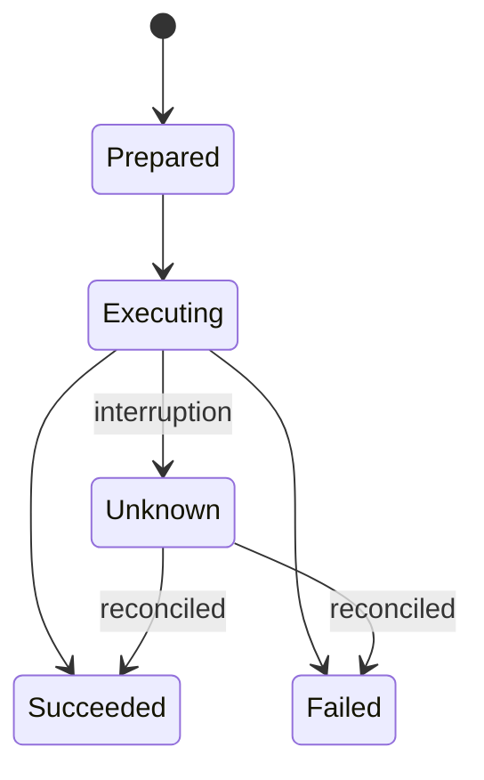

# Objects and responsibilities

These are stable responsibilities, not a requirement that every row remain a separate class.

| Object | Responsibility | Lifetime / truth |
|---|---|---|
| `AgentClient` | Authenticate/sign out, create sessions, send/cancel turns, expose provider-neutral events | Process-local; provider owns conversation semantics |
| `CodexAgentClient` | Implement `AgentClient` with app-server and a supplied process launcher | Process-local; starts as one coherent class |
| `AgentEvent` | Represent authentication, session, text, tool, completion, and failure events | Transient stream |
| `SessionId` | Opaque provider session correlation | Persist only if Step 01 proves resumption works |
| `ForegroundSessionController` | Own one client/session, bounded streaming state, turn exclusion, tool-request claims, and terminal close/sign-out ordering while UI comes and goes | One explicitly started foreground-service lifetime; contains no Android type or approval decision |
| `ToolCall` / `ToolResult` | Correlate a requested operation with Android's observed outcome | Transient; `callId` is not an idempotency guarantee |
| `ToolDefinition` | Publish a bounded name, description, and input schema to app-server dynamic tools | Static registration; carries no Android authority |
| `DeviceTool` | Describe and execute one Android-owned capability | Registered locally; default deny |
| `ToolExecutor` | Validate registration, scope, approval, and dispatch | Core policy boundary |
| `ApprovalPolicy` | Decide deny, allow, or require a user decision | Core policy; mutation defaults to user approval |
| `ResourceScopeId` | Opaque reference to an Android-controlled SAF grant | Durable only while its OS grant remains valid |
| `MutationJournal` | Persist mutation intent/state, recovery data, acknowledgement, and retention ordering | Core contract with app-private Android SQLite implementation; unresolved rows survive process death |

## Mutation states

`Unknown` is a valid, user-visible outcome. Reconciliation is observation-only. Retry behavior is tool-specific, requires a fresh prepared plan, and must not be inferred from a generic call ID.
