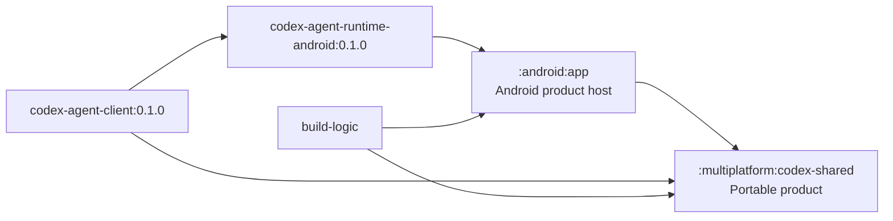

# Architecture

## Module and dependency boundaries

All Gradle modules live under root-level `modules`. There are two production
modules: one shared KMP module and one Android application. Tooling has no
production dependency edge.

`codex-shared` is physically `commonMain`-only. It owns the product session
controller, application state and reducers, DataStore preference semantics,
and Compose Multiplatform UI. It consumes the published portable agent API.

The Android app owns concrete framework mechanisms: Activity/Application,
foreground service and notification, permissions and storage discovery,
browser intents, app-private paths, and the RaTeX bitmap/view bridge. It uses
the published Android runtime factory and does not duplicate agent or runtime
implementation.

## Runtime

`codex-agent-runtime-android:0.1.0` supplies the exact App Server binary and its
Android runtime mechanisms as a versioned AAR. Codex Mobile verifies the same
binary SHA-256 in the packaged APK and does not build or download the agent.

The published runtime preserves packaged identity and executable verification,
the minimal allowlisted environment, session certificate bundle, SQLite log
privacy guard, bounded UTF-8 JSON-line framing, process shutdown, and socket
forwarding behavior.

Outbound App Server traffic still uses its authenticated loopback CONNECT
proxy. Only TLS port 443 and public destinations are accepted.

## Extensions

The app uses the official App Server plugin and skill protocol for discovery,
installation, enablement, removal, and MCP authentication. There is no mobile
provider API, custom marketplace/source host, downloaded executable extension,
or dependency on another repository.
